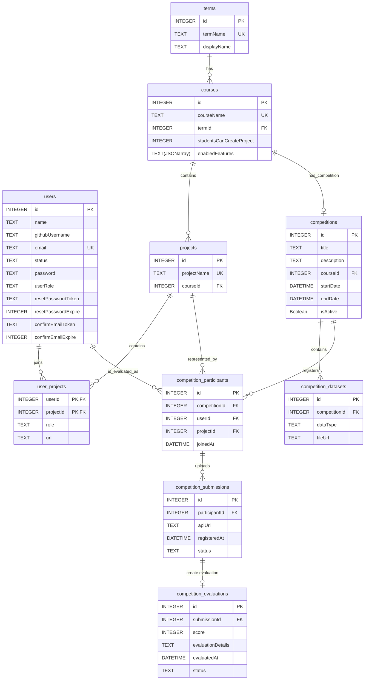

# ER-Diagramm

```mermaid
erDiagram
    users {
        INTEGER id PK
        TEXT name
        TEXT githubUsername
        TEXT email UK
        TEXT status
        TEXT password
        TEXT userRole
        TEXT resetPasswordToken
        INTEGER resetPasswordExpire
        TEXT confirmEmailToken
        INTEGER confirmEmailExpire
    }

    user_projects {
        INTEGER userId PK, FK
        INTEGER projectId PK, FK
        TEXT role
        TEXT url
    }

    terms {
        INTEGER id PK
        TEXT termName UK
        TEXT displayName
    }

    courses {
        INTEGER id PK
        TEXT courseName UK
        INTEGER termId FK
        INTEGER studentsCanCreateProject
        TEXT(JSONarray) enabledFeatures 
    }

    projects {
        INTEGER id PK
        TEXT projectName UK
        INTEGER courseId FK
    }

    competitions {
        INTEGER id PK
        TEXT title
        TEXT description
        INTEGER courseId FK
        DATETIME startDate
        DATETIME endDate
        Boolean isActive
    }

    competition_datasets {
        INTEGER id PK
        INTEGER competitionId FK
        TEXT dataType
        TEXT fileUrl
    }

    competition_participants {
        INTEGER id PK
        INTEGER competitionId FK
        INTEGER userId FK
        INTEGER projectId FK
        DATETIME joinedAt
    }

    competition_submissions {
        INTEGER id PK
        INTEGER participantId FK
        TEXT apiUrl
        DATETIME registeredAt
        TEXT status
    }

    competition_evaluations {
        INTEGER id PK
        INTEGER submissionId FK
        INTEGER score
        TEXT evaluationDetails
        DATETIME evaluatedAt
        TEXT status
    }

    terms ||--o{ courses : "has"
    courses ||--o{ projects : "contains"
    users ||--o{ user_projects : "joins"
    projects ||--o{ user_projects : "contains"
    courses ||--o| competitions : "has_competition"
    competitions ||--o{ competition_datasets : "contains"
    competitions ||--o{ competition_participants : "registers"
    
    competition_participants ||--o{ competition_submissions : "uploads"
    

    competition_submissions ||--o| competition_evaluations : "create evaluation"
    
    
    users ||--o{ competition_participants : "is_evaluated_as"
    projects ||--o{ competition_participants : "represented_by"

```
